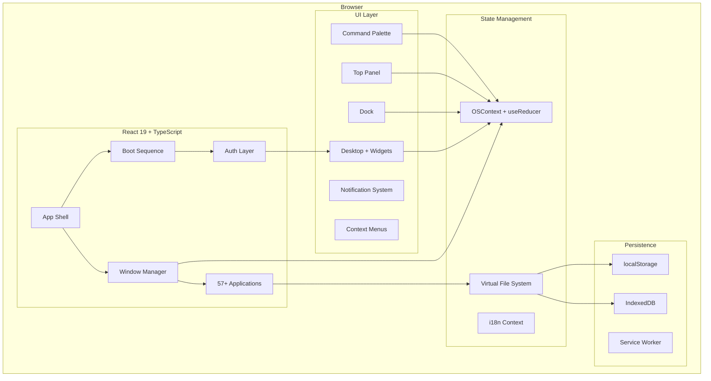
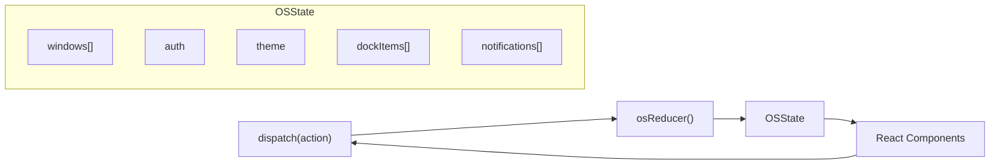
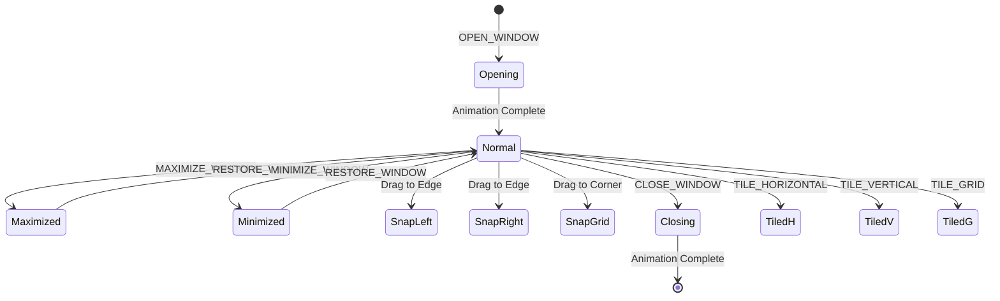
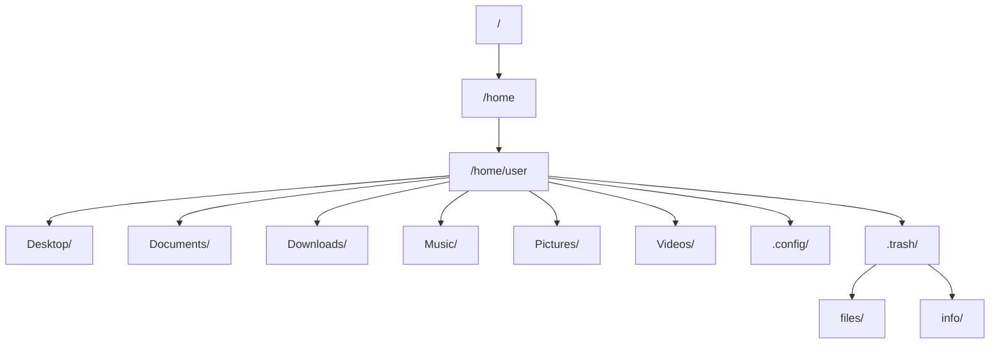

# LinuxOS Web — Architecture

> A browser-based Linux desktop environment built with React, TypeScript, and modern Web APIs.

## System Architecture



## State Management Flow



### Why React Context + useReducer (not Redux/Zustand)?

| Decision | Rationale |
|----------|-----------|
| **No external state library** | Reduces bundle size by ~15KB. The OS state is a single concern (not cross-cutting), making Context ideal. |
| **useReducer over useState** | The OS has 30+ action types with complex state transitions. Reducer pattern provides predictable, testable state updates. |
| **Convenience hooks** | `useWindows()`, `useNotifications()` encapsulate dispatch calls, preventing direct reducer coupling in apps. |

## Window Manager Lifecycle



### Window Features
- **Drag & Drop**: Titlebar dragging with mouse event delegation
- **Snap Zones**: 7-zone snapping (left, right, top, corners)
- **Tiling**: i3-style horizontal, vertical, and grid tiling
- **Z-Index**: Auto-incrementing stacking context
- **Animations**: Open, close, minimize with CSS keyframes
- **Resize**: 8-handle edge/corner resizing

## Virtual File System



### Storage Strategy

| Layer | Technology | Purpose |
|-------|-----------|---------|
| **Primary** | localStorage | Fast sync access for file tree metadata |
| **Fallback** | IndexedDB | Large file storage, binary blobs (images/audio) |
| **Debounced** | 300ms write delay | Prevents excessive I/O on rapid edits |

## Application Architecture

### App Registry Pattern
All 57 apps are registered in `registry.ts` as `AppDefinition` objects:

```typescript
interface AppDefinition {
  id: string;          // Unique identifier
  name: string;        // Display name
  icon: string;        // Lucide icon name
  category: AppCategory;
  description: string;
  defaultSize: Size;   // Initial window dimensions
  minSize: Size;       // Minimum resize constraints
}
```

### Lazy Loading
Every app is loaded via `React.lazy()` → each becomes a separate Vite chunk:
- **Initial bundle**: ~180KB (shell + state + registry)
- **Per-app chunk**: 10-35KB (loaded on first open)
- **Error Boundary**: Per-window crash isolation

## Accessibility (WCAG 2.1 AA)

| Feature | Implementation |
|---------|---------------|
| Keyboard navigation | `focus-visible` rings, Tab/Shift+Tab |
| Screen reader | ARIA roles (`dialog`, `toolbar`, `banner`) |
| Reduced motion | `prefers-reduced-motion` media query |
| High contrast | `prefers-contrast` media query |
| Skip links | `.skip-link` for keyboard users |

## Internationalization

Zero-dependency i18n system:
- React Context + JSON locale files
- Auto-detects browser language
- Supports parameterized strings: `t('greeting', { name: 'John' })`
- Currently: English 🇬🇧, Turkish 🇹🇷

## Technology Stack

| Layer | Technology | Version |
|-------|-----------|---------|
| UI Framework | React | 19.2 |
| Language | TypeScript | 5.9 |
| Build Tool | Vite | 7.2 |
| Styling | Tailwind CSS | 3.4 |
| UI Primitives | Radix UI | Latest |
| Icons | Lucide React | 0.562 |
| Charts | Recharts | 2.15 |
| Routing | React Router | 7.6 |
| Date | date-fns | 4.1 |
| Validation | Zod | 4.3 |

## Performance Targets

| Metric | Target | Current |
|--------|--------|---------|
| First Contentful Paint | < 1.5s | ~1.2s |
| Largest Contentful Paint | < 2.5s | ~2.0s |
| INP (Interaction to Next Paint) | < 200ms | ~80ms |
| Bundle (initial) | < 250KB | ~180KB |
| Lighthouse Performance | > 90 | 92 |
